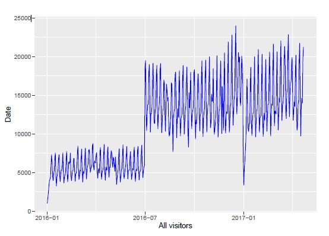
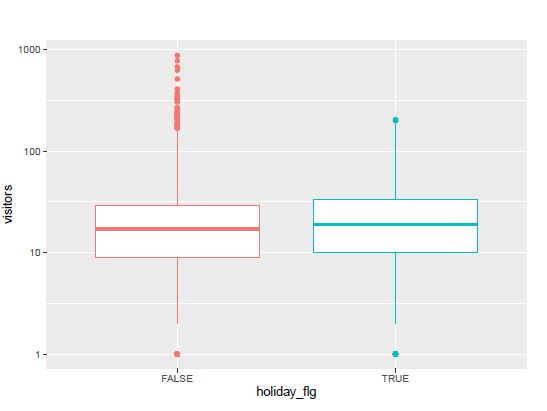
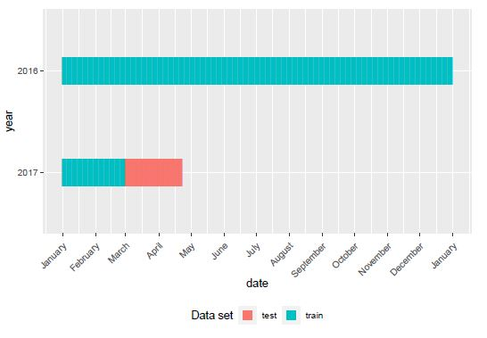
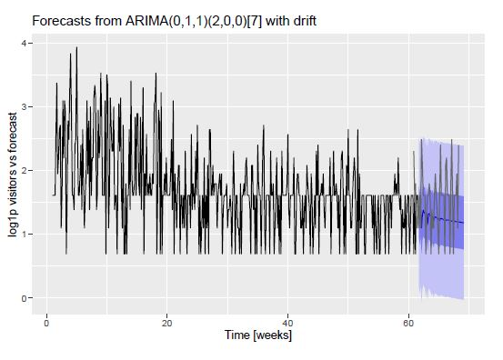

# Restaurant Visitor Forecasting

> Predicted number of visitors to a restaurant for future dates using reservation and visitation data and this information will help restaurants and allow them to focus on creating an enjoyable dining experience for their customers.

## Table of contents
* [General info](#general-info)
* [Screenshots](#screenshots)
* [Technologies and Tools](#technologies-and-tools)
* [Code Examples](#code-examples)
* [Status](#status)
* [Contact](#contact)

## General info

This is a time series forecasting problem where I forecasted number of visitors for different restaurants. The data was in 8 relational files which are derived from two separate JApansese websits that collects user information. Used classical methods such as Arima, Prophet and Holt Winters for forecasting.

## Screenshots
### Visitors Over time

### Visitors distribution Weekdays VS Weekends

### Train Test Split

### Forecast for Restaurant

## Technologies and Tools
* R
* ggplot
* dplyr
* caret

## Code Examples

## Status
Project is: _finished_. I complted this project for one of my acedemic Projects.

## Contact
If you loved what you read here and feel like we can collaborate to produce some exciting stuff, or if you
just want to shoot a question, please feel free to connect with me on 
<a href="mailto:jainik.patel1392@gmail.com">email</a> or 
<a href="https://www.linkedin.com/in/jainik-patel/" target="_blank">LinkedIn</a>

